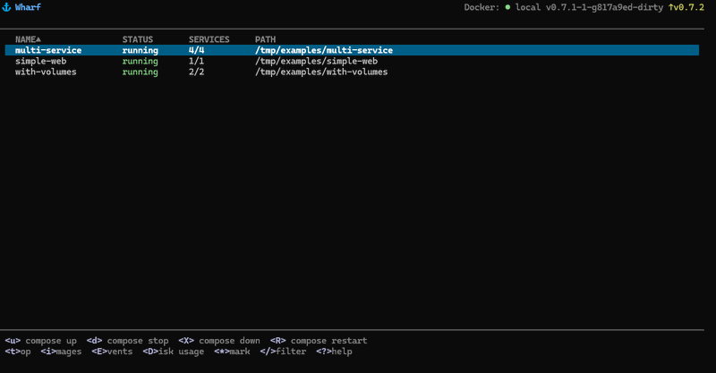

# ⚓ Wharf

[](https://github.com/idesyatov/wharf/actions/workflows/ci.yml)
[](https://github.com/idesyatov/wharf/releases)
[](go.mod)
[](https://goreportcard.com/report/github.com/idesyatov/wharf)
[](LICENSE)

A terminal UI for managing Docker Compose stacks. Inspired by [k9s](https://github.com/derailed/k9s).

<p align="center">
  
</p>

## Features

- Browse and manage Docker Compose projects and services
- Compose up / stop / down / restart / build / validate
- Docker Compose profiles support (`:up <profile>` / `:up *`)
- Exec into containers with shell banner
- Real-time CPU/MEM/Network monitoring with braille charts (Top View)
- Stream container logs with follow/pause and search
- Browse files inside containers (File Browser)
- Edit compose files with your $EDITOR
- Inspect container details — ports, volumes, environment, networks, health checks
- Manage volumes, networks, and images
- Docker System overview with disk usage
- Live Docker events monitoring
- Custom commands from config with template variables
- Command mode with Tab-autocomplete (:exec, :go, :validate, :theme, :host, :up...)
- Remote Docker host via SSH (`:host ssh://user@server`)
- Host Switcher (`H`) — saved hosts with add/delete, connect by name
- Bookmark favorite projects (★), bulk operations (Space)
- Vim-style navigation (hjkl, gg/G, /, :q, arrows)
- Customizable themes (dark/light/custom YAML)
- Single binary, zero dependencies

## Quick Start

### Install (Linux/macOS)

```bash
curl -sL https://raw.githubusercontent.com/idesyatov/wharf/master/scripts/install.sh | bash
```

### Homebrew

```bash
brew tap idesyatov/tap
brew install wharf
```

### Download binary

Download from [GitHub Releases](https://github.com/idesyatov/wharf/releases):

| Platform | Archive |
|----------|---------|
| Linux amd64 | `wharf-vX.X.X-linux-amd64.tar.gz` |
| Linux arm64 | `wharf-vX.X.X-linux-arm64.tar.gz` |
| macOS Intel | `wharf-vX.X.X-darwin-amd64.tar.gz` |
| macOS Apple Silicon | `wharf-vX.X.X-darwin-arm64.tar.gz` |
| Windows amd64 | `wharf-vX.X.X-windows-amd64.zip` |

### From source

```bash
git clone https://github.com/idesyatov/wharf.git
cd wharf
make docker-build-all    # Go not required — builds via Docker
```

## Usage

```bash
wharf            # start TUI
wharf --version  # show version
wharf --config   # show config path and current settings
```

<details>
<summary>Keybindings</summary>

| Key | Action | Context |
|-----|--------|---------|
| `j`/`k`/`↑`/`↓` | Navigate up/down | All |
| `h`/`←`/`Esc` | Go back | All |
| `l`/`→`/`Enter` | Select / drill down | All |
| `gg` / `G` | Jump to top / bottom | All |
| `1`–`6` | Sort by column | Tables |
| `/` | Filter / search | All |
| `?` | Help | All |
| `q` / `:q` | Quit | All |
| | | |
| `s` / `S` / `r` | Start / Stop / Restart service | Services |
| `e` | Exec into container | Services, Detail |
| `L` | View logs | Services, Detail |
| `t` | Resource monitor (top) | Projects, Services |
| `F` | Browse container files | Services, Detail |
| `x` | Remove stopped container | Services |
| `H` | Host Switcher | Projects |
| | | |
| `u` | Compose up | Projects |
| `d` | Compose stop | Projects |
| `X` | Compose down (removes containers) | Projects |
| `R` | Compose restart | Projects |
| `b` / `B` | Build service / all | Services |
| | | |
| `c` | Compose file preview | Services |
| `e` | Edit compose file ($EDITOR) | Compose |
| `v` / `n` | Volumes / Networks | Services |
| `i` | Images | Projects |
| `E` | Docker events | Projects |
| `D` | System disk usage | Projects |
| `*` | Toggle bookmark | Projects |
| `y` / `Y` | Copy ID / full info | Services, Detail |
| `f` | Toggle log follow/pause | Logs |
| `w` | Export image to tar | Images |
| `P` | Prune | Volumes, Images, System |
| `Space` | Toggle select (bulk) | Projects |

</details>

<details>
<summary>Command Mode (press <code>:</code> then Tab to autocomplete)</summary>

| Command | Action |
|---------|--------|
| `:q` / `:q!` | Quit |
| `:up [profile]` | Compose up with profile (`:up debug`, `:up *` for all) |
| `:down [profile]` | Compose down with profile (`:down debug`, `:down *`) |
| `:host [name/url]` | Show / switch Docker host by name or URL (ssh://, tcp://) |
| `:hosts` | Open Host Switcher view |
| `:go <n>` | Jump to project by name |
| `:exec <n>` | Exec into container by name |
| `:validate [name]` | Validate compose file |
| `:theme dark/light` | Switch theme |
| `:version` | Show version info |
| `:save [path]` | Save logs to file (Logs view) |
| `:edit` | Edit compose file (Compose view) |
| `:help` | Show help |

</details>

<details>
<summary>Custom Commands</summary>

Define custom commands in config — they appear in Services View menu bar:

```yaml
# ~/.config/wharf/config.yaml
custom_commands:
  - name: "Rails Console"
    key: "1"
    command: "docker exec -it {{.ContainerID}} rails console"
  - name: "Run Tests"
    key: "2"
    command: "docker exec -it {{.ContainerID}} bundle exec rspec"
```

Template variables: `{{.ContainerID}}`, `{{.ContainerName}}`, `{{.Image}}`, `{{.ProjectName}}`, `{{.ProjectPath}}`

</details>

## Configuration

```yaml
# ~/.config/wharf/config.yaml
poll_interval: 2s
log_tail: 100
max_log_lines: 1000
theme: dark
docker_host: ""
mouse: false
bookmarks:
  - my-project
hosts:
  - name: "prod"
    url: "ssh://deploy@prod.example.com"
  - name: "staging"
    url: "ssh://deploy@staging.srv"
keybindings:
  quit: "ctrl+q"
```

Custom themes: `~/.config/wharf/themes/<n>.yaml`

## Examples

See [examples/](examples/) for sample compose projects:

| Example | Description |
|---------|-------------|
| `simple-web` | Single nginx container |
| `multi-service` | App + worker + Redis + API |
| `with-volumes` | Services with persistent volumes |
| `with-profiles` | Compose profiles (debug, monitoring, test) |

## Tech Stack

**Go** + [Bubbletea](https://github.com/charmbracelet/bubbletea) + [Lipgloss](https://github.com/charmbracelet/lipgloss) + [Docker SDK](https://pkg.go.dev/github.com/docker/docker/client)

## Contributing

Contributions are welcome! See [CONTRIBUTING.md](CONTRIBUTING.md) for details.

## License

MIT — see [LICENSE](LICENSE).
